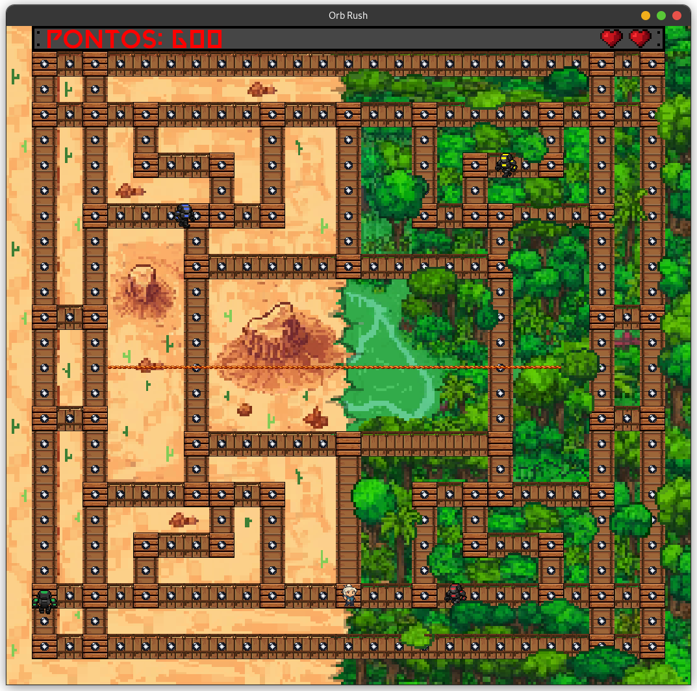

# Orb Rush 🕹️



**Orb Rush** é um jogo de arcade 2D feito em **C++17** com a biblioteca **SFML**.
Inspirado no clássico Pac-Man, com uma temática baseada em **Valorant**: você
controla a agente **Jett**, percorre um labirinto coletando todos os Orbes e
desviando de quatro robôs inimigos com comportamentos distintos.

Originalmente foi um trabalho final da disciplina de *Algoritmos e Estruturas de
Dados II*, escrito como um único arquivo procedural (sem classes, por exigência
da época). Este repositório é a versão **refatorada e modernizada** em uma
arquitetura orientada a objetos.

---

## ✨ Funcionalidades

* **Jogabilidade clássica** inspirada no Pac-Man, com tema Valorant.
* **Inimigos com IA:** dois robôs perseguem o jogador usando **BFS (busca em
  largura)** e dois se movem de forma aleatória.
* **Movimentação fluida** baseada em grade com sistema de *intenção de
  movimento*, deixando os controles responsivos.
* **Power Pellets + modo "caçável":** ao comer um orbe especial (nos quatro
  cantos), os inimigos ficam vulneráveis por alguns segundos — encoste neles
  para mandá-los de volta ao ponto inicial e ganhar pontos extras. *(novo)*
* **Recorde persistente:** a maior pontuação é salva em `highscore.txt`. *(novo)*
* **Pausa:** tecla `P` ou `Esc` durante a partida. *(novo)*
* **Teletransporte** pelas cordas nas laterais do mapa.
* **Interface completa:** menu, créditos, *game over*, vitória e HUD com vidas,
  pontuação e recorde.
* **Sprites animados** e trilha sonora temática.

---

## 🗂️ Estrutura do projeto

```
.
├── CMakeLists.txt        # build principal (CMake)
├── Makefile              # build alternativo (g++)
├── include/              # headers (.hpp)
│   ├── Config.hpp        # constantes, enums e caminhos de assets
│   ├── ResourceManager.hpp
│   ├── Map.hpp / Pathfinding.hpp
│   ├── Player.hpp / Ghost.hpp
│   └── Game.hpp
├── src/                  # implementações (.cpp)
│   ├── main.cpp          # ponto de entrada
│   ├── Map.cpp / Pathfinding.cpp
│   ├── Player.cpp / Ghost.cpp
│   └── Game.cpp
├── assets/
│   ├── images/  (.png/.jpg)
│   ├── audio/   (.mp3)
│   └── fonts/   (Valorant_Font.ttf)
├── docs/                 # screenshots
└── legacy/               # código original (monolítico), preservado p/ referência
```

### O que mudou na refatoração

| Antes (monolítico)                              | Depois (OOP)                                    |
|-------------------------------------------------|-------------------------------------------------|
| 1 arquivo, `main()` com ~1900 linhas            | módulos separados por responsabilidade          |
| Estado global espalhado                         | encapsulado em `Game`, `Player`, `Ghost`, `Map` |
| BFS copiado e colado para cada fantasma         | uma função `pathfinding::nextStep`              |
| 4 fantasmas com ~70 linhas duplicadas cada      | uma classe `Ghost` parametrizada                |
| ~30 blocos repetidos de carregamento de textura | `ResourceManager` com cache                     |
| Números mágicos pelo código                     | centralizados em `Config.hpp`                   |

---

## 🚀 Como Compilar e Executar

Você precisa da **SFML (>= 2.5)** instalada.

* **Linux (Debian/Ubuntu):** `sudo apt install libsfml-dev cmake g++`
* **macOS (Homebrew):** `brew install sfml@2 cmake`
* **Windows:** baixe a SFML em <https://www.sfml-dev.org/download.php>

> ⚠️ **Assets:** a versão original deste trabalho não versionou todos os
> recursos. Coloque as imagens, áudios e a fonte dentro de `assets/images`,
> `assets/audio` e `assets/fonts` respectivamente (veja a lista abaixo).
>
> 🛟 **O jogo roda mesmo sem os assets originais.** Se um arquivo faltar, o
> `ResourceManager` gera um *placeholder* procedural (Jett em ciano, robôs
> coloridos, pílulas, corredores) e usa uma fonte do sistema. Assets ausentes
> apenas emitem um aviso no terminal — nada de crash. Basta soltar os arquivos
> originais nas pastas para ter a arte de volta.

### Opção 1 — CMake (recomendado)

```bash
cmake -B build
cmake --build build
./build/OrbRush
```

O CMake copia a pasta `assets/` para junto do executável automaticamente.

### Opção 2 — Makefile

```bash
make run
```

Execute a partir da raiz do projeto (os caminhos de assets são relativos a ela).

---

## 🎮 Como Jogar

* **Objetivo:** coletar todos os orbes do mapa.
* **Vidas:** você começa com 3; perde uma ao ser tocado por um robô (exceto no
  modo caçável).
* **Power Pellets:** os orbes maiores nos cantos deixam os robôs vulneráveis.
* **Teletransporte:** use as cordas nas laterais.

### Controles

| Tecla            | Ação                          |
|------------------|-------------------------------|
| Setas            | Mover a Jett                  |
| Enter            | Selecionar nos menus          |
| `P` / `Esc`      | Pausar / retomar              |

---

## 📦 Lista de assets esperados

* **Sprites Jett:** `spritesheet.png`, `spritesheet2.png`, `spritesheet3.png`
* **Robôs:** `robo{azul,vermelho,amarelo,verde}{1,2,3}.png`
* **Mapa/UI:** `fundo3.png`, `menu.png`, `copas2.png`, `heart.png`, `orb.png`,
  `corda.png`, `horizontalcheio.png`, `verticalcheio.png`, `canto1..4.jpg`,
  `t1..4.jpg`, `cruzamento.jpg`
* **Áudio:** `menu.mp3`, `inicio.mp3`, `jogo.mp3`, `flawless.mp3`, `victory.mp3`,
  `defeat.mp3`
* **Fonte:** `Valorant_Font.ttf`

---

## 🧑‍💻 Créditos

* **Gabriel Costa Reis**
* **Marcos Vinicius Mariano Dias**
* **Victor Alexandre S. Ribeiro**

Mapa e mecânicas base do Pac-Man: *Prof. André Gustavo dos Santos*.
